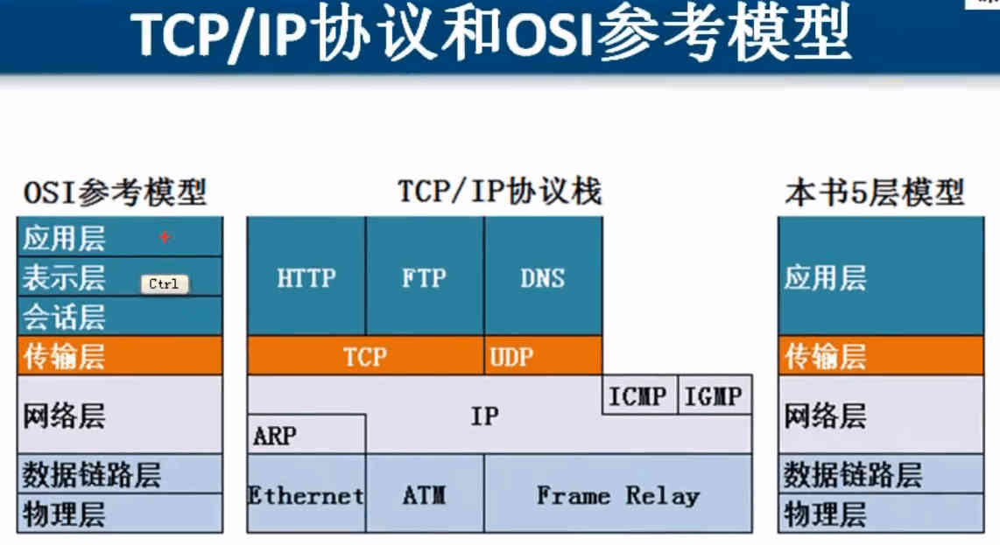
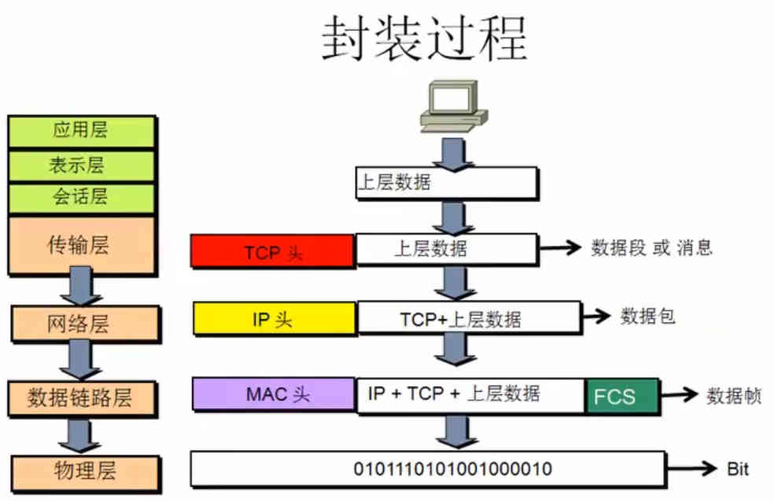
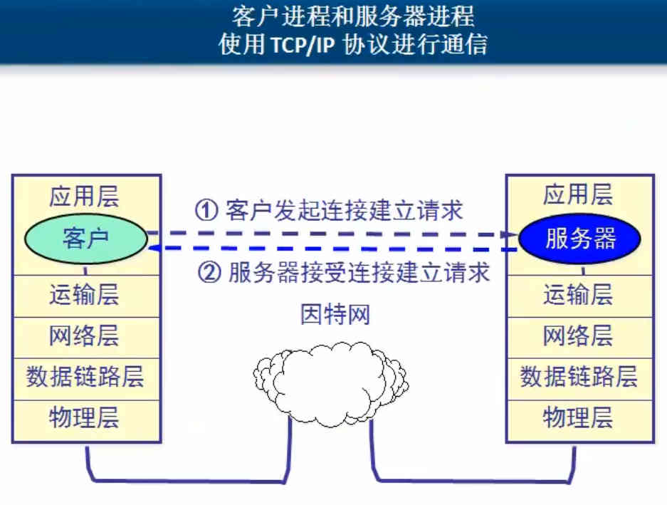

# 计算机网络概述

局域网：覆盖范围小，自己花钱买设备，带宽固定，自己维护

局域网：距离远，花钱租带宽

Internet ISP 自己的机房，对网民提供访问Internet连接

## OSI参考模型

- 应用层：所有能产生网络流量的程序
- 表示层：在传输之前是否进行加密或压缩处理，二进制ASCII
- 会话层：查木马 netstat -n
- 传输层：可靠传输，流量控制，不可靠传输
- 网络层：负责选择最佳路径，规划IP地址
- 数据链路层：帧的开始和结束 透明传输，差错校验
- 物理层：接口标准，电器标准，如何在物理链路上传输更快的速度

#### 0SI参考模型对网络排错指导

按照从底层自下而上排查

1. 物理层故障：查看连接状态，发送和接收的数据包
2. 数据链路层故障：MAC冲突，ADSL欠费，网速没办法协商一致，计算机连接到错误的VLAN
3. 网络层故障：配置错误IP地址，子网掩码，配置错误的网关，路由器没有配置到达目标网络的路由
4. 应用层故障：应用程序配置错误

#### OSI参考模型和网络安全

1. 物理层安全
2. 数据链路层安全：ADSL账号密码，VLAN交换机端口绑定MAC地址
3. 网络层安全
4. 应用层安全

## TCP/IP协议和OSI参考模型

